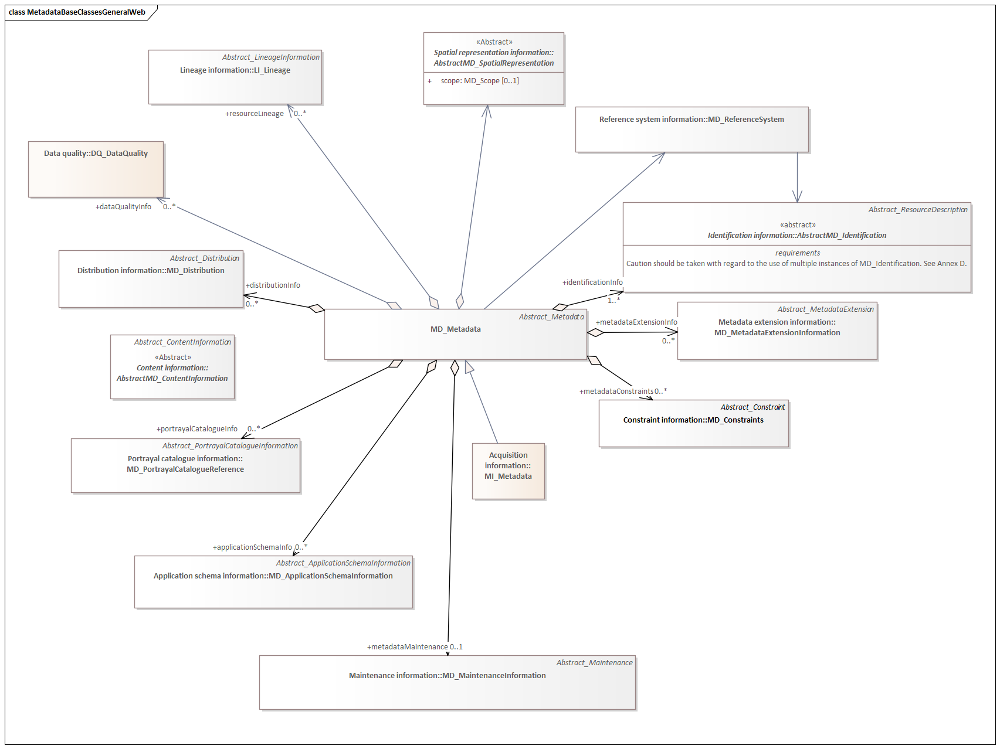

= Metadata Base (MDB)
:edition: 1.3
:revdate: 2021-02-15

== Metadata Base (MDB) Version: 1.3

.Overview of the MD_Metadata class and linked classes
. Specifics of the MD_Metadata class and its associated classes

image::./MdBaseClass.png[UML diagram of MetaData Base class MD_Metadata in the mda namespace and associated classes,750]

=== Description

MDB 1.3 is an XML Schema implementation derived from ISO 19115-1, Geographic
Information - Metadata - Part 1: Fundamentals, Clause 6.5.2. It includes mandatory
elements for describing resources that are not services. The XML schema was encoded
using the rules described in ISO/TS 19139:2007.

=== XML Namespace for mdb 1.3

The namespace URI for mdb 1.3 is `https://schemas.isotc211.org/19115/-1/mdb/1.3`.

=== XML Schema for mdb 1.3

https://schemas.isotc211.org/19115/-1/mdb/1.3.0/mdb.xsd[mdb.xsd] is the XML Schema document to
be referenced by XML documents containing XML elements in the mdb 1.3 namespace or by
XML Schema documents importing the mdb 1.3 namespace. This XML schema includes
(indirectly) all the implemented concepts of the mdb namespace, but it does not
contain the declaration of any types.

=== Related XML Schema for mdb 1.3

https://schemas.isotc211.org/19115/-1/mdb/1.3.0/metadataBase.xsd[metadataBase.xsd] implements
the UML conceptual schema defined in ISO 19115-1, Geographic Information - Metadata -
Part 1: Fundamentals, Clause 6.5.2. It was created using the encoding rules defined
in ISO 19118, ISO 19139.

https://schemas.isotc211.org/19115/-1/mdb/1.3.0/metadataBase.xsd contains the following classes:

* MD_Metadata
* MD_MetadataScope

=== Related XML Namespaces for mdb 1.3

The mdb 1.3 namespace imports these other namespaces:

[%unnumbered]
[options=header,cols=4]
|===
| Name | Standard Prefix | Namespace Location | Schema Location

| Citation and responsible party information Citation and responsible party
information | cit |
`https://schemas.isotc211.org/19115/-1/cit/1.3.0` | https://schemas.isotc211.org/19115/-1/cit/1.3.0/cit.xsd[cit.xsd]
| Data Quality Common Classes | dqc |
`https://schemas.isotc211.org/19157/-2/dqc/1.3.0` | https://schemas.isotc211.org/19157/-2/dqc/1.3.0/dqc.xsd[dqc.xsd]
| Geographic Common Objects | gco |
`https://schemas.isotc211.org/19103/-/gco/1.2.0` | https://schemas.isotc211.org/19103/-/gco/1.2/gco.xsd[gco.xsd]
| Geospatial EXtent | gex |
`https://schemas.isotc211.org/19115/-1/gex/1.3.0` | https://schemas.isotc211.org/19115/-1/gex/1.3.0/gex.xsd[gex.xsd]
| Language localization | lan |
`https://schemas.isotc211.org/19115/-1/lan/1.3.0` | https://schemas.isotc211.org/19115/-1/lan/1.3.0/lan.xsd[lan.xsd]
| Metadata Common Classes | mcc |
`https://schemas.isotc211.org/19115/-1/mcc/1.3.0` | https://schemas.isotc211.org/19115/-1/mcc/1.3.0/mcc.xsd[mcc.xsd]
| Metadata COnstraints | mco |
`https://schemas.isotc211.org/19115/-1/mco/1.3.0` | https://schemas.isotc211.org/19115/-1/mco/1.3.0/mco.xsd[mco.xsd]
| Metadata for Resource Identification | mri |
`https://schemas.isotc211.org/19115/-1/mri/1.3.0` | https://schemas.isotc211.org/19115/-1/mri/1.3.0/mri.xsd[mri.xsd]
| Metadata Spatial Representation | msr |
`https://schemas.isotc211.org/19115/-1/msr/1.3.0` | https://schemas.isotc211.org/19115/-1/msr/1.3.0/msr.xsd[msr.xsd]
| Metadata Reference System | mrs |
`https://schemas.isotc211.org/19115/-1/mrs/1.3.0` | https://schemas.isotc211.org/19115/-1/mrs/1.3.0/mrs.xsd[mrs.xsd]
| Metadata EXtension information | mex |
`https://schemas.isotc211.org/19115/-1/mex/1.3.0` | https://schemas.isotc211.org/19115/-1/mex/1.3.0/mex.xsd[mex.xsd]
| Metadata Resource Content | mrc |
`https://schemas.isotc211.org/19115/-1/mrc/1.3.0` | https://schemas.isotc211.org/19115/-1/mrc/1.3.0/mrc.xsd[mrc.xsd]
| Metadata Resource Distribution | mrc |
`https://schemas.isotc211.org/19115/-1/mrd/1.3.0` | https://schemas.isotc211.org/19115/-1/mrd/1.3.0/mrd.xsd[mrd.xsd]
| Metadata Application Schemas | mas |
`https://schemas.isotc211.org/19115/-1/mas/1.3.0` | https://schemas.isotc211.org/19115/-1/mas/1.3.0/mas.xsd[mas.xsd]
| Metadata Maintenance Information | mmi |
`https://schemas.isotc211.org/19115/-1/mmi/1.3.0` | https://schemas.isotc211.org/19115/-1/mmi/1.3.0/mmi.xsd[mmi.xsd]
| Metadata Resource Lineage | mrl |
`https://schemas.isotc211.org/19115/-1/mrl/1.3.0` | https://schemas.isotc211.org/19115/-1/mrl/1.3.0/mrl.xsd[mrl.xsd]
| Metadata ACquisition | mac |
`https://schemas.isotc211.org/19115/-2/mpc/2.2.0` | https://schemas.isotc211.org/19115/-2/mac/2.2.0/mac.xsd[mac.xsd]
|===

=== Schematron Validation Rules for mdb 1.3

Schematron rules for validating instance documents of the mdb 1.3 namespace are in
https://schemas.isotc211.org/19115/-1/mdb/1.3.0/mdb.sch[mdb.sch].

=== Working Versions

When revisions to these schema become necessary, they will be managed in the
https://github.com/ISO-TC211/XML[ISO TC211 Git Repository].
