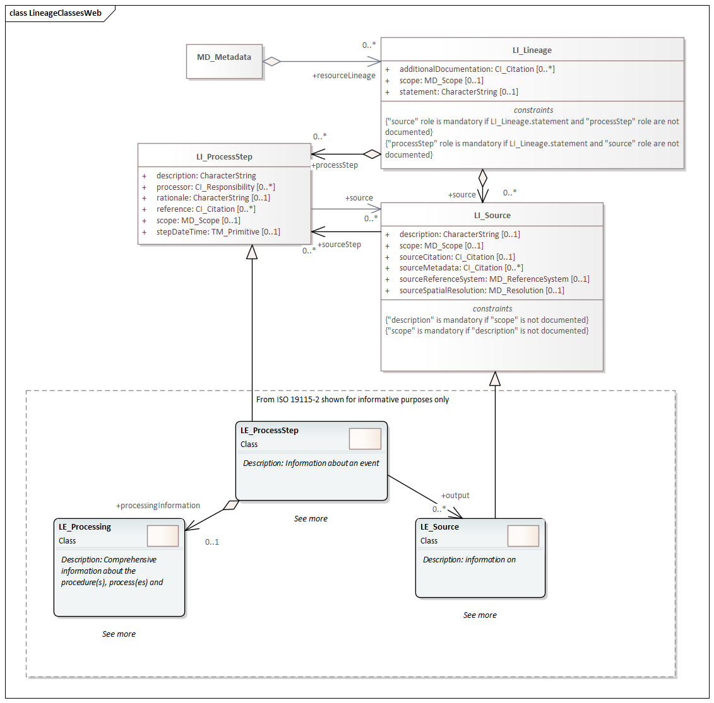

= Metadata for Resource Lineage (MRL)
:edition: 1.3
:revdate: 2021-02-16

== Metadata for Resource Lineage (MRL) Version: 1.3

.Classes in the mrl namespace

=== Description

MRL 1.3 is an XML Schema implementation derived from ISO 19115-1, Geographic
Information - Metadata - Part 2: Extensions for acquisition and processing, Clause
6.3.3. It includes elements for describing resource lineage. The XML schema was
encoded using the rules described in ISO/TS 19139:2007.

=== XML Namespace for mrl 1.3

The namespace URI for mrl 1.3 is `https://schemas.isotc211.org/19115/-1/mrl/1.3`.

=== XML Schema for mrl 1.3

https://schemas.isotc211.org/19115/-1/mrl/1.3.0/mrl.xsd[mrl.xsd] is the XML Schema document to
be referenced by XML documents containing XML elements in the mrl 1.3 namespace or by
XML Schema documents importing the mrl 1.3 namespace. This XML schema includes
(indirectly) all the implemented concepts of the mrl namespace, but it does not
contain the declaration of any types.

=== Related XML Schema for mrl 1.3

https://schemas.isotc211.org/19115/-1/mrl/1.3.0/lineage.xsd[lineage.xsd] implements the UML
conceptual schema defined in ISO 19115-1, Geographic Information - Metadata - Part 2:
Extensions for acquisition and processing, Clause 6.3.3. It was created using the
encoding rules defined in ISO 19118, ISO 19139.

https://schemas.isotc211.org/19115/-1/mrl/1.3.0/lineage.xsd contains the following classes:

* LI_Lineage
* LI_ProcessStep
* LI_Source

https://schemas.isotc211.org/19115/-2/mrc/2.2.0/lineageImagery.xsd[lineageImagery.xsd]
implements the UML conceptual schema defined in ISO 19115-2, Geographic Information -
Metadata - Part 2: Extensions for acquisition and processing, Clause 6.3.3.
Information about
https://schemas.isotc211.org/19115/-2/mrc/2.2.0/lineageImagery.xsd[lineageImagery.xsd] can be
obtained from
https://schemas.isotc211.org/19115/-2/mrl/2.2.0/

=== Related XML Namespaces for mrl 1.3

The mrl 1.3 namespace imports these other namespaces:

[%unnumbered]
[options=header,cols=4]
|===
| Name | Standard Prefix | Namespace Location | Schema Location

| Geographic Common Objects | gco |
`https://schemas.isotc211.org/19103/-/gco/1.2.0` | https://schemas.isotc211.org/19103/-/gco/1.2/gco.xsd[gco.xsd]
| Geographic Markup Wrappers | gmw |
`https://schemas.isotc211.org/19163/-/gmw/1.1.0` | https://schemas.isotc211.org/19163/-/gmw/1.1/gmw.xsd[gmw.xsd]
| Metadata Common Classes | mcc |
`https://schemas.isotc211.org/19115/-1/mcc/1.3.0` | https://schemas.isotc211.org/19115/-1/mcc/1.3.0/mcc.xsd[mcc.xsd]
| Metadata for Services | srv |
`https://schemas.isotc211.org/19115/-1/srv/1.3.0` | https://schemas.isotc211.org/19115/-1/srv/1.3.0/srv.xsd[srv.xsd]
| CITation and Responsibility | cit |
`https://schemas.isotc211.org/19115/-1/cit/1.3.0` | https://schemas.isotc211.org/19115/-1/cit/1.3.0/cit.xsd[cit.xsd]
| Geospatial MetaLanguage | gml |
http://schemas.opengis.net/gml/3.2.1/gml.xsd |
http://schemas.opengis.net/gml/3.2.1/gml.xsd
|===

=== Schematron Validation Rules for mrl 1.3

Schematron rules for validating instance documents of the mrl 1.3 namespace are in
https://schemas.isotc211.org/19115/-1/mrl/1.3.0/mrl.sch[mrl.sch].

=== Working Versions

When revisions to these schema become necessary, they will be managed in the
https://github.com/ISO-TC211/XML[ISO TC211 Git Repository].
