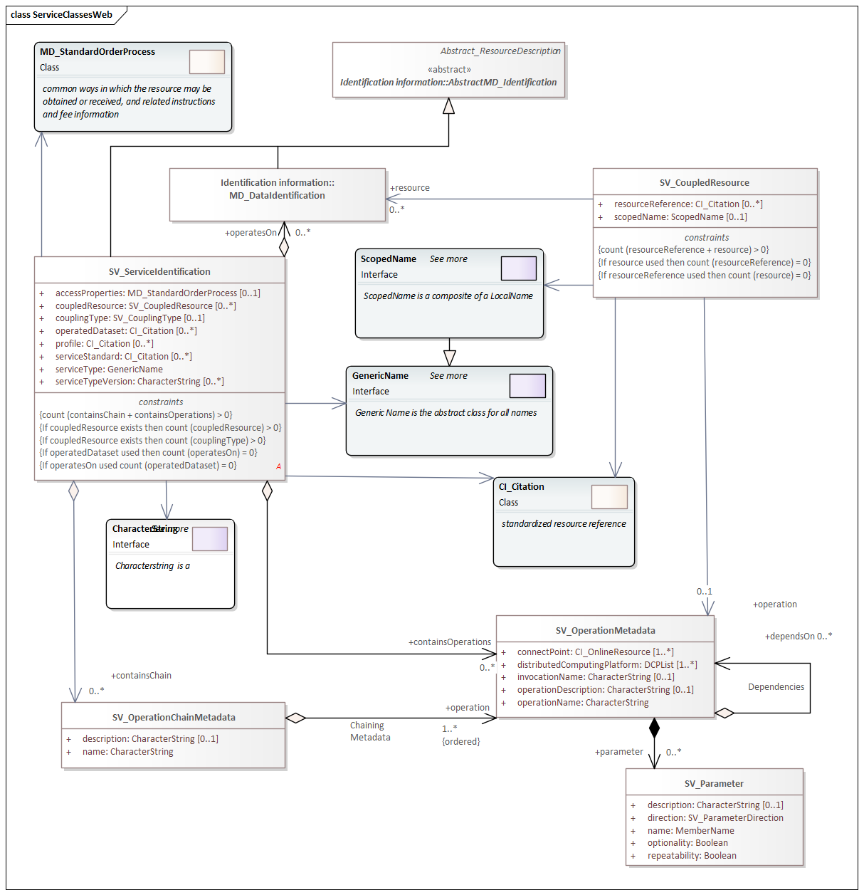

= Metadata for Services (SRV)
:edition: 1.3
:revdate: 2019-01-04

== metadata for SeRVices (SRV) Version: 1.3

.Classes in the srv namespace

.Codelists in the srv namespace
image::./ServiceCodelist.png[UML diagram of Metadata for SeRVices codelists in the srv namespace,400]

=== Description

SRV 1.3 is an XML Schema implementation derived from ISO 19115-1, Geographic
Information - Metadata - Part 1: Fundamentals, Clause 6.5.14. It includes elements
for describing services. The XML schema was encoded using the rules described in
ISO/TS 19139:2007.

=== XML Namespace for srv 1.3

The namespace URI for srv 1.3 is *https://schemas.isotc211.org/19115/-1/srv/1.3*.

=== XML Schema for srv 1.3

*link:../../../../19115/-1/srv/1.3.0/srv.xsd[srv.xsd]* is the XML Schema document to
be referenced by XML documents containing XML elements in the srv 1.3 namespace or by
XML Schema documents importing the srv 1.3 namespace. This XML schema includes
(indirectly) all the implemented concepts of the srv namespace, but it does not
contain the declaration of any types.

=== Related XML Schema for srv 1.3

*link:../../../../19115/-1/srv/1.3.0/serviceInformation.xsd[serviceInformation.xsd]*
implements the UML conceptual schema defined in ISO 19115-1, Geographic Information -
Metadata - Part 1: Fundamentals, Clause 6.5.14. It was created using the encoding
rules defined in ISO 19118, ISO 19139.

https://schemas.isotc211.org/19115/-1/srv/1.3.0/serviceInformation.xsd contains the following classes:

* SV_ServiceIdentification
* SV_OperationMetadata
* SV_OperationChainMetadata
* SV_Parameter
* SV_CoupledResource

https://schemas.isotc211.org/19115/-1/srv/1.3.0/serviceInformation.xsd contains references to the following codelists:

* DCPList
* SV_CouplingType
* SV_ParameterDirection

=== Related XML Namespaces for srv 1.3

The srv 1.3 namespace imports these other namespaces: mrd cit

[%unnumbered]
[options=header,cols=4]
|===
| Name | Standard Prefix | Namespace Location | Schema Location

| Geographic Common Objects | gco |
https://schemas.isotc211.org/19103/-/gco/1.2.0 | ../../../../19103/-/gco/1.2/gco.xsd
| Metadata Common Classes | mcc |
https://schemas.isotc211.org/19115/-1/mcc/1.3.0 | ../../../../19115/-1/mcc/1.3.0/mcc.xsd
| Metadata for Resource Identification | mri |
https://schemas.isotc211.org/19115/-1/mri/1.3.0 | ../../../../19115/-1/mri/1.3.0/mri.xsd
| CITataion and Responsibility | cit |
https://schemas.isotc211.org/19115/-1/cit/1.3.0 | ../../../../19115/-1/cit/1.3.0/cit.xsd
| Metadata for Resource Distribution | cit |
https://schemas.isotc211.org/19115/-1/mrd/1.3.0 | ../../../../19115/-1/mrd/1.3.0/mrd.xsd
|===

=== Schematron Validation Rules for srv 1.3

Schematron rules for validating instance documents of the srv 1.3 namespace are in
https://schemas.isotc211.org/19115/-1/srv/1.3.0/srv.sch[srv.sch].

=== Working Versions

When revisions to these schema become necessary, they will be managed in the
https://github.com/ISO-TC211/XML[ISO TC211 Git Repository].
