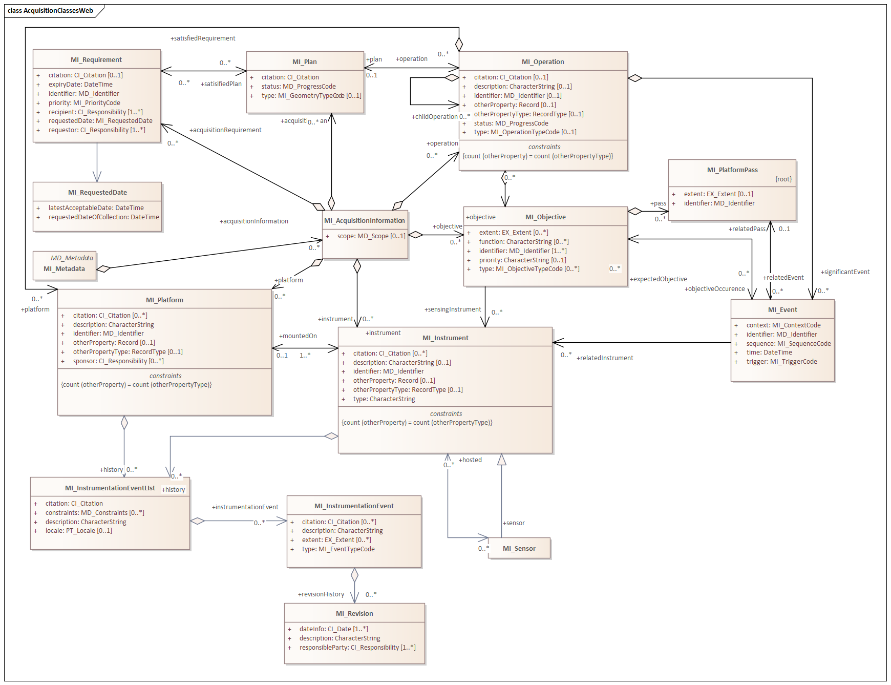

= Metadata for Acquisition (MAC)
:edition: 2.2
:revdate: 2021-02-16

== Metadata for Acquisition (MAC) Version: 2.2

.Classes in the mac namespace
====

image::./AcquisitionCodelist.png[UML diagram of Metadata for Acquisition codelists in the mac namespace,600]
====

=== Description

MAC 2.2 is an XML Schema implementation derived from ISO 19115-2, Geographic
Information - Metadata - Part 2: Extensions for acquisition and processing, Clause
6.3.2. It includes information related to acquisition platforms, instruments,
operations and other details. The XML schema was encoded using the rules described in
ISO/TS 19139:2007, Clause 8.

=== XML Namespace for mac 2.2

The namespace URI for mac 2.2 is *https://schemas.isotc211.org/19115/-2/mac/2.2*.

=== XML Schema for mac 2.2

*link:mac.xsd[mac.xsd]* is the XML Schema document to be referenced by XML documents
containing XML elements in the mac 2.2 namespace or by XML Schema documents importing
the mac 2.2 namespace. This XML schema includes (indirectly) all the implemented
concepts of the mac namespace, but it does not contain the declaration of any types.

=== Related XML Schema for mac 2.2

*link:../../../../19115/-2/mac/2.2.0/acquisitionInformationImagery.xsd[acquisitionInformationImagery.xsd]*
implements the UML conceptual schema defined in ISO 19115-2,
Geographic Information - Metadata - Part 2: Extensions for acquisition and
processing, Clause 6.3.2. It was created using the encoding rules defined in ISO
19118, ISO 19139. Within
link:../../../../19115/-2/mac/2.2.0/acquisitionInformationImagery.xsd[acquisitionInformationImagery.xsd]
the MI_Metadata class inherits attribute from MD_Metadata (
link:../../../../19115/-1/mdb/1.3.0/[../../../../19115/-1/mdb/1.3]).

https://schemas.isotc211.org/19115/-2/mac/2.2.0/acquisitionInformationImagery.xsd
contains the following classes:

* MI_Metadata
* MI_AcquisitionInformation
* MI_EnvironmentalRecord
* MI_Instrument
* MI_Sensor
* MI_Objective
* MI_Operation
* MI_Plan
* MI_Event
* MI_Platform
* MI_PlatformPass
* MI_RequestedDate
* MI_Requirement
* MI_InstrumentationEventList
* MI_InstrumentEvent
* MI_Revision

https://schemas.isotc211.org/19115/-2/mac/2.2.0/acquisitionInformationImagery.xsd
contains references to the following codelists:

* MI_EventTypeCode
* MI_ContextCode
* MI_GeometryTypeCode
* MI_ObjectiveTypeCode
* MI_OperationTypeCode
* MI_PriorityCode
* MI_SequenceCode
* MI_TriggerCode

=== Related XML Namespaces for mac 2.2

The mac 2.2 namespace imports these other namespaces:

[%unnumbered]
[options=header,cols=4]
|===
| Name | Standard Prefix | Namespace Location | Schema Location

| Geographic Common Objects | gco |
https://schemas.isotc211.org/19103/-/gco/1.2 | ../../../../191103/-/gco/1.2.0/gco.xsd
| Geographic Markup Wrappers | gmw |
https://schemas.isotc211.org/19163/-/gmw/1.1 | ../../../../19136/-/gmw/1.1.0/gmw.xsd
| Geospatial MetaLanguage | gml |
http://schemas.opengis.net/gml/3.2.1/gml.xsd |
http://schemas.opengis.net/gml/3.2.1/gml.xsd
| Language localization | lan |
https://schemas.isotc211.org/19115/-1/lan/1.3.0 | ../../../../19115/-1/lan/1.3.0/lan.xsd
| Metadata Common Classes | mcc |
https://schemas.isotc211.org/19115/-1/mcc/1.3.0 | ../../../../19115/-1/mcc/1.3.0/mcc.xsd
| Geographic Extent | gex |
https://schemas.isotc211.org/19115/-1/gex/1.3.0 | ../../../../19115/-1/gex/1.3.0/gex.xsd
| CITation and Responsibility | cit |
https://schemas.isotc211.org/19115/-1/cit/1.3.0 | ../../../../19115/-1/cit/1.3.0/cit.xsd
|===

=== Working Versions

When revisions to these schema become necessary, they will be managed in the
https://github.com/ISO-TC211/XML[ISO TC211 Git Repository].
