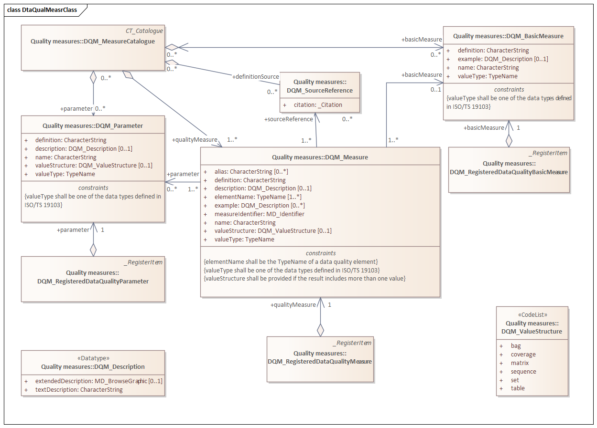

= Data Quality Measures (DQM)
:edition: 1.1.0
:revdate: 2010-02-26

== Data Quality Measures (DQM) Version 1.2.0

.Classes in the dqm namespace

=== Description

Data Quality Measures (DQM) is an XML Schema implementation of abstract classes for
ISO 19157, Geographic Information - Data Quality. It includes elements for defining
geometry and functions for coverages. The XML schema was encoded using the encoding
rules defined in ISO 19118, ISO 19139.

=== XML Namespace for Data Quality Measures (DQM) Version: 1.2

The namespace URI for Data Quality [abstract classes] (DQM) Version 1.2.0 is
`https://schemas.isotc211.org/19157/-/dqm/1.2`.

=== XML Schema for Data Quality Measures (DQM) Version 1.2.0

https://schemas.isotc211.org/19157/-/dqm/1.2.0/dqm.xsd[dqm.xsd] is the XML Schema document to
be referenced by XML documents containing XML elements in the dqm namespace or by XML
Schema documents importing the dqm 1.2 namespace. This XML schema includes
(indirectly) all the implemented concepts of the dqm namespace, but it does not
contain the declaration of any types.

=== Related XML Schema for dqm 1.2

https://schemas.isotc211.org/19157/-/dqm/1.2.0/qualityMeasures.xsd
implements the UML conceptual schema defined in ISO 19157, Geographic Information -
Data Quality. It was created using the encoding rules defined in ISO 19118, ISO 19139.

https://schemas.isotc211.org/19157/-/dqm/1.2.0/qualityMeasures.xsd contains the following classes:

* DQM_BasicMeasure
* DQM_Description
* DQM_Measure
* DQM_MeasureCatalogue
* DQM_Parameter
* DQM_RegisteredDataQualityBasicMeasure
* DQM_RegisteredDataQualityMeasure
* DQM_RegisteredDataQualityParameter
* DQM_SourceReference
* DQM_ValueStructure

=== Related XML Namespaces for ISO 19157 DQM 1.2

The DQM 1.2.0 imports these other namespaces:

[%unnumbered]
[options=header,cols=4]
|===
| Name | Standard Prefix | Namespace Location | Schema Location

| Geographic Common Objects | gco |
`https://schemas.isotc211.org/19103/-/gco/1.2.0` | https://schemas.isotc211.org/19103/-/gco/1.2.0/gco.xsd[gco.xsd]
| Feature Catalogue Common | fcc |
https://schemas.isotc211.org/19110/-/fcc/2.2 | https://schemas.isotc211.org/19110/-/fcc/2.2.0/fcc.xsd[fcc.xsd]
| General Feature Catalogue | gfc |
https://schemas.isotc211.org/19110/-/gfc/2.2 | https://schemas.isotc211.org/19110/-/gfc/2.2.0/gfc.xsd[gfc.xsd]
| CITation and responsibility | cit |
https://schemas.isotc211.org/19115/-1/cit/1.3 | https://schemas.isotc211.org/19115/-1/cit/1.3.0/cit.xsd[cit.xsd]
| Metadata Common Classes | mcc |
https://schemas.isotc211.org/19115/-1/mcc/1.3 | https://schemas.isotc211.org/19115/-1/mcc/1.3.0/mcc.xsd[mcc.xsd]
|===

=== Working Versions

When revisions to these schema become necessary, they will be managed in the
https://github.com/ISO-TC211/XML[ISO TC211 Git Repository].
