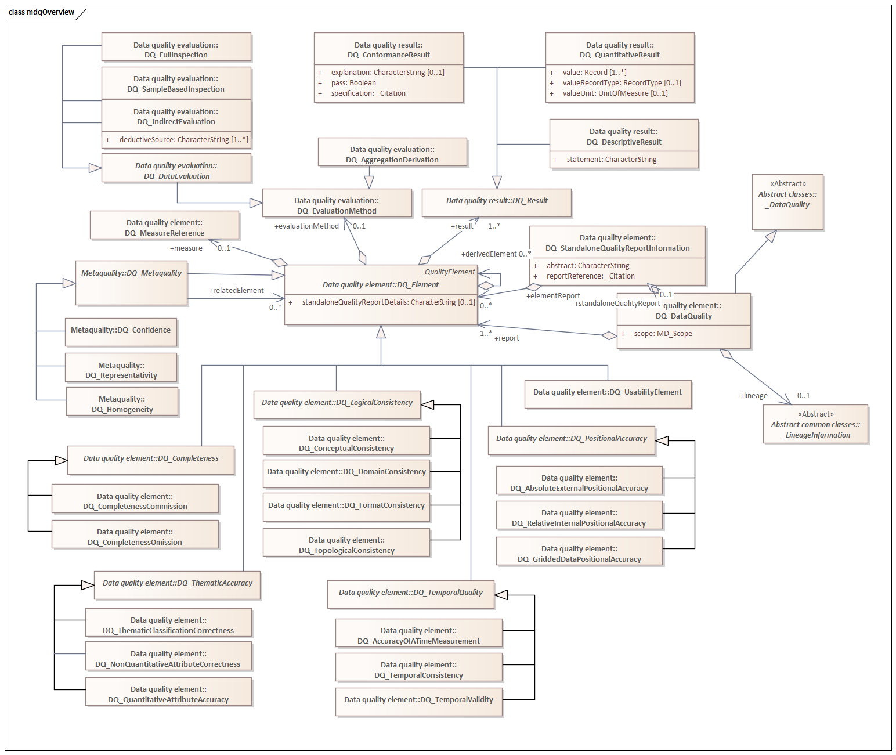
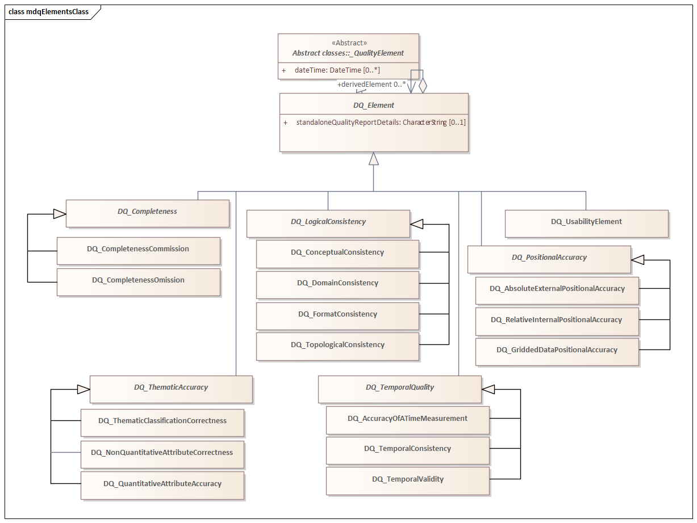
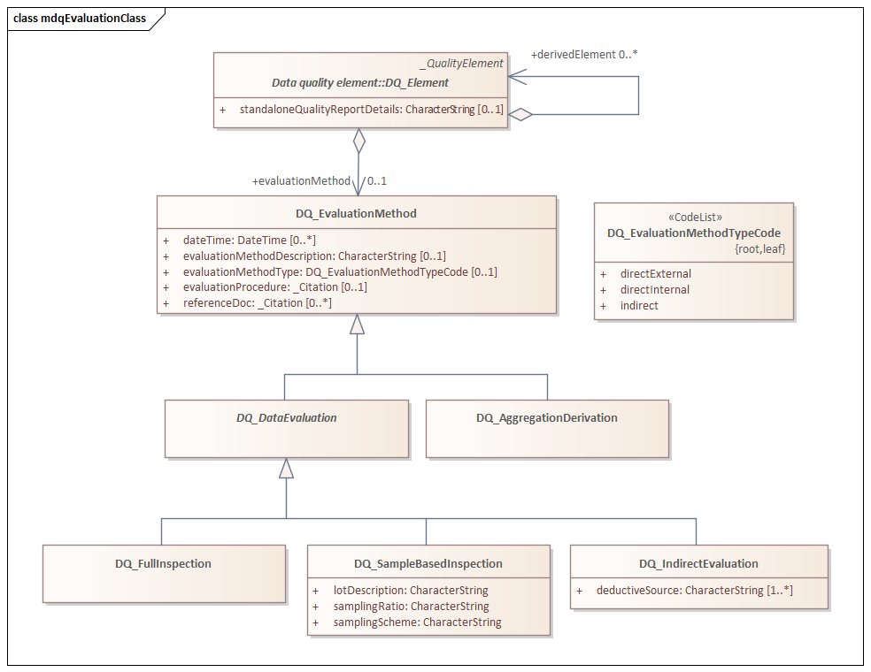
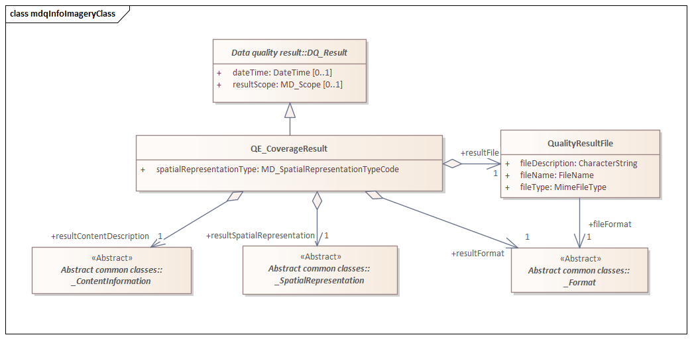

= Metadata Data Quality (MDQ)
:edition: 1.1.0
:revdate: 2010-02-26

== Metadata for Data Quality (MDQ) Version 1.2.0

.Overview of classes in the mdq namespace

=== Description

Metadata for Data Quality (MDQ) is an XML Schema implementation of abstract classes
for ISO 19157, Geographic Information - Data Quality. It includes elements for
defining geometry and functions for coverages. The XML schema was encoded using the
encoding rules defined in ISO 19118, ISO 19139.

=== XML Namespace for Metadata for Data Quality (MDQ) Version: 1.2

The namespace URI for Data Quality [abstract classes] (MDQ) Version 1.2.0 is
`https://schemas.isotc211.org/19157/-/mdq/1.2`.

=== XML Schema for Metadata for Data Quality (MDQ) Version 1.2.0

https://schemas.isotc211.org/19157/-/mdq/1.2.0/mdq.xsd[mdq.xsd] is the XML Schema document to
be referenced by XML documents containing XML elements in the mdq namespace or by XML
Schema documents importing the mdq 1.2 namespace. This XML schema includes
(indirectly) all the implemented concepts of the mdq namespace, but it does not
contain the declaration of any types.

=== Related XML Schema for mdq 1.2

https://schemas.isotc211.org/19157/-/mdq/1.2.0/dataQualityElement.xsd
implements the UML conceptual schema defined in ISO 19157, Geographic Information -
Data Quality. It was created using the encoding rules defined in ISO 19118, ISO
19139.

.Classes in the data quality elements schema of mdq namespace

https://schemas.isotc211.org/19157/-/mdq/1.2.0/dataQualityElement.xsd contains the following classes:

* DQ_AbsoluteExternalPositionalAccuracy
* DQ_AccuracyOfATimeMeasurement
* AbstractDQ_Completeness
* DQ_CompletenessCommission
* DQ_CompletenessOmission
* DQ_ConceptualConsistency
* DQ_DataInspection
* DQ_DataQuality
* DQ_DomainConsistency
* AbstractDQ_Element
* DQ_FormatConsistency
* DQ_GriddedDataPositionalAccuracy
* AbstractDQ_LogicalConsistency
* DQ_MeasureReference
* DQ_NonQuantitativeAttributeCorrectness
* AbstractDQ_PositionalAccuracy
* DQ_QuantitativeAttributeAccuracy
* DQ_RelativeInternalPositionalAccuracy
* DQ_StandaloneQualityReportInformation
* DQ_TemporalConsistency
* AbstractDQ_TemporalQuality
* DQ_TemporalValidity
* AbstractDQ_ThematicAccuracy
* DQ_ThematicClassificationCorrectness
* DQ_TopologicalConsistency
* DQ_UsabilityElement

https://schemas.isotc211.org/19157/-/mdq/1.2.0/dataQualityResult.xsd
implements the UML conceptual schema defined in ISO 19157, Geographic Information -
Data Quality. It was created using the encoding rules defined in ISO 19118, ISO
19139.

.Classes in the data quality results schema of mdq namespace
image::mdqResultsClass.png[UML diagram of classes in the data quality results schema from Metadata for Data Quality (MDQ) in the mdq namespace,750]

https://schemas.isotc211.org/19157/-/mdq/1.2.0/dataQualityResult.xsd contains the following classes:

* DQ_ConformanceResult
* DQ_DescriptiveResult
* DQ_QuantitativeResult
* AbstractDQ_Result

https://schemas.isotc211.org/19157/-/mdq/1.2.0/dataQualityEvaluation.xsd
implements the UML conceptual schema defined in ISO 19157, Geographic Information -
Data Quality. It was created using the encoding rules defined in ISO 19118, ISO
19139.

.Classes in the data quality evaluation schema of mdq namespace

https://schemas.isotc211.org/19157/-/mdq/1.2.0/dataQualityEvaluation.xsd
contains the following classes:

* DQ_AggregationDerivation
* AbstractDQ_DataEvaluation
* DQ_EvaluationMethod
* DQ_EvaluationMethodTypeCode
* DQ_FullInspection
* DQ_IndirectEvaluation
* DQ_SampleBasedInspection

https://schemas.isotc211.org/19157/-/mdq/1.2.0/metaquality.xsd
implements the UML conceptual schema defined in ISO 19157, Geographic Information -
Data Quality. It was created using the encoding rules defined in ISO 19118, ISO
19139.

.Classes in the data quality metaquality schema of mdq namespace
image::mdqMetaqualityClass.png[UML diagram of classes in the data quality metaquality schema from Metadata for Data Quality (MDQ) in the mdq namespace,750]

https://schemas.isotc211.org/19157/-/mdq/1.2.0/metaquality.xsd contains the following classes:

* DQ_Confidence
* DQ_Homogeneity
* AbstractDQ_Metaquality
* DQ_Representativity

https://schemas.isotc211.org/19157/-/mdq/1.2.0/dataQualityImagery.xsd
implements the UML conceptual schema defined in ISO 19157, Geographic Information -
Data Quality Amendment 1: Describing data quality using coverages. It was created
using the encoding rules defined in ISO 19118, ISO 19139.

.Classes in the data quality information - imagery schema of mdq namespace

https://schemas.isotc211.org/19157/-/mdq/1.2.0/dataQualityImagery.xsd contains the following classes:

* QE_CoverageResult
* QualityResultFile

=== Related XML Namespaces for ISO 19157 MDQ 1.2

The MDQ 1.2.0 imports these other namespaces:

[%unnumbered]
[options=header,cols=4]
|===
| Name | Standard Prefix | Namespace Location | Schema Location

| Data Quality Common | dqc |
https://schemas.isotc211.org/19157/-/dqc/1.2 | https://schemas.isotc211.org/19157/-/dqc/1.2.0/dqc.xsd[dqc.xsd]
| Geographic Common Objects | gco |
`https://schemas.isotc211.org/19103/-/gco/1.2.0` | https://schemas.isotc211.org/19103/-/gco/1.2.0/gco.xsd[gco.xsd]
| Geographic Common objects eXtended | gcx |
`https://schemas.isotc211.org/19103/-/gcx/1.2.0` | https://schemas.isotc211.org/19103/-/gcx/1.2.0/gcx.xsd[gcx.xsd]
| CITation and responsibility | cit |
https://schemas.isotc211.org/19115/-1/cit/1.3 | https://schemas.isotc211.org/19115/-1/cit/1.3.0/cit.xsd[cit.xsd]
| Metadata Common Classes | mcc |
https://schemas.isotc211.org/19115/-1/mcc/1.3 | https://schemas.isotc211.org/19115/-1/mcc/1.3.0/mcc.xsd[mcc.xsd]
| Metadata Resource Distribution | mrd |
https://schemas.isotc211.org/19115/-1/mrd/1.3 | https://schemas.isotc211.org/19115/-1/mrd/1.3.0/mrd.xsd[mrd.xsd]
| Metadata for Spatial Representation | msr |
https://schemas.isotc211.org/19115/-1/msr/1.3 | https://schemas.isotc211.org/19115/-1/msr/1.3.0/msr.xsd[msr.xsd]
| Metadata Resource Content | mrc |
https://schemas.isotc211.org/19115/-1/mrc/1.3 | https://schemas.isotc211.org/19115/-1/mrc/1.3.0/mrc.xsd[mrc.xsd]
| Geographic Markup Language | gml |
http://schemas.opengis.net/gml/3.2 |
http://schemas.opengis.net/gml/3.2.1/gml.xsd
| Geographic Markup language Wrapper | gml |
https://schemas.isotc211.org/19136/-/gmw/1.1 | https://schemas.isotc211.org/19136/-/gmw/1.1.0/gmw.xsd
|===

=== Working Versions

When revisions to these schema become necessary, they will be managed in the
https://github.com/ISO-TC211/XML[ISO TC211 Git Repository].
